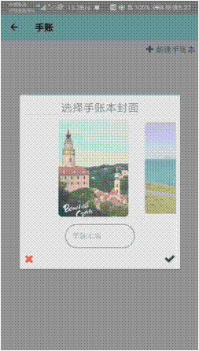
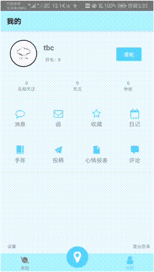

# 风语 · Winsper

2019 夏季小学期项目管理及软件开发课程设计项目

## 项目定位

一款专注于记录心情、分享生活的校园社交APP

    
    

## 如何安装

仓库根目录中 `app-release.apk` 为该应用的 apk，克隆仓库到本地，将 apk 发送至安卓手机即可自动识别并安装。

## 如何使用

见[用户手册](./doc/用户手册.md)

## 开发团队

**mosaikerors**

+ 袁健勇 [sjyjytu](<https://github.com/sjyjytu>)
+ 蔡子诺 [zncai](<https://github.com/zncai>)
+ 陶伯承 [Gusabary](<https://github.com/Gusabary>)
+ 项羽心 [DeeEII-X](<https://github.com/DeeEll-X>)

##### Last-modified date: 2019.9.10, 8 p.m.