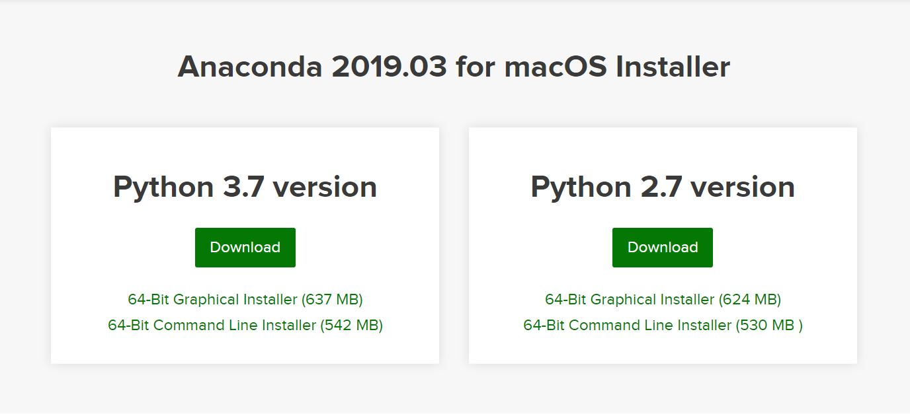
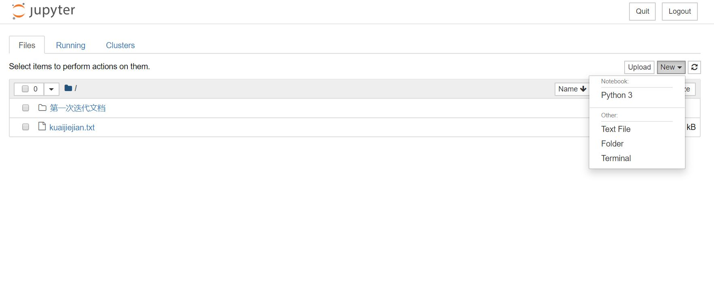

# AI环境配置

## 1. 下载 [Anaconda](https://www.anaconda.com/distribution/)

**注:** 选择python3.7版本


   > Anaconda is a free and open-sourcedistribution of the Python and R programming languages for scientific computing (data science, machine learning applications, large-scale data processing, predictive analytics, etc.), that aims to simplify package management and deployment. Package versions are managed by the package management system conda. The Anaconda distribution is used by over 15 million users and includes more than 1500 popular data-science packages suitable for Windows, Linux, and MacOS.  

## 2. 利用 Anaconda 配置环境

### 2.1 创建虚拟环境
```
conda create -n [your env name] sqlite
```
```
activete [your env name] #进入虚拟环境
```
```
deactivate #退出虚拟环境
```
### 2.2 安装package
在进入虚拟环境后，使用`conda install [package name]`或者`pip install [package name]`命令安装所需要的包(由于Anaconda镜像原因，国内下载比较缓慢，建议使用pip或者配置国内镜像)
```
pip install numpy #用于高效的矩阵计算
```
```
pip install --upgrade tensorflow #用于机器学习的模型训练、预测
```
```
pip install jupyter #python及时交互平台
```
### 2.3 检验安装成果
1. 在 Anaconda Prompt 命令行
   ```
   cd [your work directory]
   ```
   ```
   activate [your env name]
   ```
   ```
   jupyter notebook
   ```
   之后会进入浏览器网页。
2. 在网页中新建一个*.ipynb文件,右上角选择python3
   
   在第一个cell中输入一下代码，`shift`+`enter`运行，观察结果
   ```
    import tensorflow as tf
    import numpy as np
    print(np.__version__)
    print(tf.__version__)
   ```

<i>Reference</i>
- [维基百科: Anaconda (Python distribution)](https://en.wikipedia.org/wiki/Anaconda_(Python_distribution))
- [使用 pip 安装 TensorFlow](https://tensorflow.google.cn/install/pip)